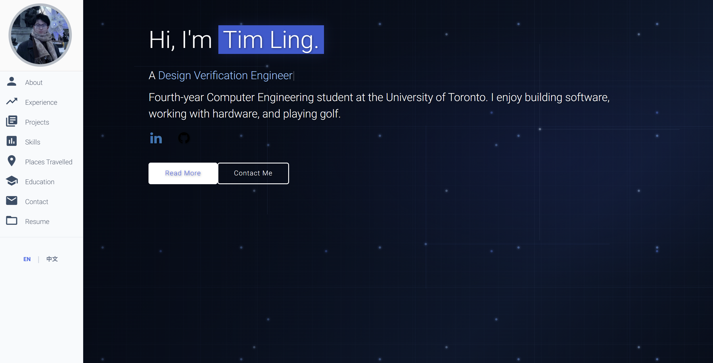

# ECE444 PRA2

Name: Tim Ling

## Acknowledgement

This repository is based on https://github.com/varadbhogayata/varadbhogayata.github.io.

# Tim Ling's Portfolio

Personal portfolio for Tim Ling, a fourth-year Computer Engineering student at the University of Toronto. Expected graduation: June 2027.

Website: [https://timling234.github.io/](https://timling234.github.io/)

## Website Preview

## About the site

The site introduces my experience, projects, skills, education, and contact information. It uses HTML, CSS, JavaScript, Materialize, and Typed.js.

## Local preview

Open `index.html` in a browser, or serve the repository directory with a local HTTP server. The site uses relative asset paths so it also works from a GitHub Pages project path.

## License

See [LICENSE](LICENSE).
